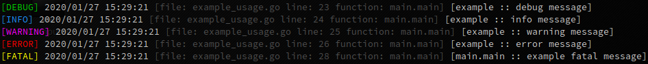
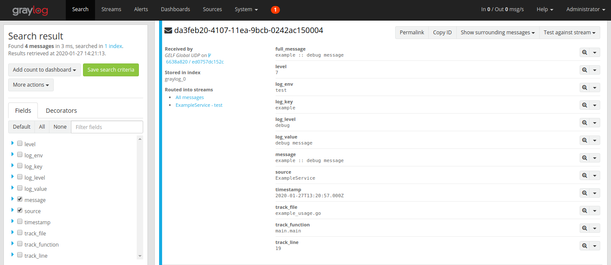

# GO - GrayLogger

[](https://github.com/takattila/graylogger/actions?query=workflow:Test)
[](https://coveralls.io/github/takattila/graylogger?branch=master)
[](https://godoc.org/github.com/takattila/graylogger)
[](https://github.com/takattila/graylogger/releases)

This package was made to provide easy-to-analyze log messages.

It can be configured to:
- print log messages only to standard output,
- or send GELF messages to Graylog at the same time. 
 
For sending GELF messages it uses the: [github.com/Devatoria/go-graylog](https://github.com/Devatoria/go-graylog) package.

[](./img/output.png)
[](./img/gelf_message.png)

## Table of Contents

* [Logging levels](#logging-levels)
* [Example usage](#example-usage)
   * [Initialization](#initialization)
      * [Example code](#example-code)
      * [Example output](#example-output)
      * [Example GELF message](#example-gelf-message)
   * [Check error and logging at the same time](#check-error-and-logging-at-the-same-time)
      * [Example code](#example-code-1)
      * [Example output](#example-output-1)
      * [Example GELF message](#example-gelf-message-1)
   * [Return with error and logging at the same time](#return-with-error-and-logging-at-the-same-time)
      * [Example code](#example-code-2)
      * [Example output](#example-output-2)
      * [Example GELF message](#example-gelf-message-2)
   * [Re-initializing GrayLogger](#re-initializing-graylogger)
      * [Example code](#example-code-3)
      * [Example output](#example-output-3)
   * [Save logs into a file](#save-logs-into-a-file)
      * [Example code](#example-code-4)
      * [Example output](#example-output-4)
   * [Tracking / tracing functions](#tracking--tracing-functions)
      * [Example code](#example-code-5)
      * [Example output](#example-output-5)

## Logging levels

- **Debug**   : designates fine-grained informational events that are most useful to debug an application.
- **Info**    : designates informational messages that highlight the progress of the application at coarse-grained level.
- **Warning** : designates potentially harmful situations.
- **Error**   : designates error events that might still allow the application to continue running.
- **Fatal**   : designates very severe error events that will presumably lead the application to abort.

[Back to top](#table-of-contents)

## Example usage

### Initialization

#### Example code

```go
g := graylogger.New(graylogger.Init{
	// Optional fields for sending GELF messages to Graylog.
	GraylogHost:     "localhost",
	GraylogPort:     12201,
	GraylogProtocol: graylogger.TransportUDP,
	GraylogProvider: "ExampleService",

	// Obligatory fields.
	LogEnv:   "test",
	LogLevel: graylogger.LevelDebug,
	LogColor: true,
})

g.Debug("example", "debug message")
g.Info("example", "info message")
g.Warning("example", "warning message")
g.Error("example", "error message")
```

[Back to top](#table-of-contents)

#### Example output

```bash
[DEBUG] 2020/01/27 14:16:54 [file: example_usage.go line: 19 function: main.main] [example :: debug message]
[INFO] 2020/01/27 14:16:54 [file: example_usage.go line: 20 function: main.main] [example :: info message]
[WARNING] 2020/01/27 14:16:54 [file: example_usage.go line: 21 function: main.main] [example :: warning message]
[ERROR] 2020/01/27 14:16:54 [file: example_usage.go line: 22 function: main.main] [example :: error message]
```

[Back to top](#table-of-contents)

#### Example GELF message

```json
{ 
   "_log_env":"test",
   "_log_key":"example",
   "_log_level":"debug",
   "_log_value":"debug message",
   "_track_file":"example_usage.go",
   "_track_function":"main.main",
   "_track_line":"19",
   "full_message":"example :: debug message",
   "host":"ExampleService",
   "level":7,
   "short_message":"example :: debug message",
   "timestamp":1580131354,
   "version":"1.1"
}
```

[Back to top](#table-of-contents)

### Check error and logging at the same time

#### Example code

```go
err := errors.New("example error message")

// Only logging error if it present
g.LogErrorIfErr(err)
g.LogWarningIfErr(err)

// Log error and exit with exit code 1
g.Fatal(err)
```

[Back to top](#table-of-contents)

#### Example output

```bash
[ERROR] 2020/01/27 14:36:49 [file: example_usage.go line: 26 function: main.main] [main.main :: example error message]
[WARNING] 2020/01/27 14:36:49 [file: example_usage.go line: 27 function: main.main] [main.main :: example error message]
[FATAL] 2020/01/27 14:36:49 [file: example_usage.go line: 30 function: main.main] [main.main :: example error message]
exit status 1
```

[Back to top](#table-of-contents)

#### Example GELF message

```json
{ 
   "_log_env":"test",
   "_log_key":"main.main",
   "_log_level":"error",
   "_log_value":"example error message",
   "_track_file":"example_usage.go",
   "_track_function":"main.main",
   "_track_line":"24",
   "full_message":"main.main :: example error message",
   "host":"ExampleService",
   "level":3,
   "short_message":"main.main :: example error message",
   "timestamp":1580131737,
   "version":"1.1"
}
```

[Back to top](#table-of-contents)

### Return with error and logging at the same time

#### Example code

```go
err := g.ReturnWithError("example returned", "error message")
g.Fatal(err)
```

[Back to top](#table-of-contents)

#### Example output

```bash
[ERROR] 2020/01/27 14:42:34 [file: example_usage.go line: 21 function: main.main] [example returned :: error message]
[FATAL] 2020/01/27 14:42:34 [file: example_usage.go line: 22 function: main.main] [main.main :: example returned :: error message]
exit status 1
```

[Back to top](#table-of-contents)

#### Example GELF message

```json
{
   "_log_env":"test",
   "_log_key":"example returned",
   "_log_level":"error",
   "_log_value":"error message",
   "_track_file":"example_usage.go",
   "_track_function":"main.main",
   "_track_line":"21",
   "full_message":"example :: error message",
   "host":"ExampleService",
   "level":3,
   "short_message":"example :: error message",
   "timestamp":1580132598,
   "version":"1.1"
}
```

[Back to top](#table-of-contents)

### Re-initializing GrayLogger

#### Example code

```go
// Before re-initialization it should log all logging levels
g.Debug("before re-init example", "debug message")
g.Info("before re-init example", "info message")
g.Warning("before re-init example", "warning message")
g.Error("before re-init example", "error message")

// Re-initialization
i := g.GetInit()
i.LogColor = false
i.LogLevel = graylogger.LevelWarning

g = graylogger.New(i)
fmt.Println()

// After re-initialization it should log only warning, error and fatal logging levels
g.Debug("after re-init example", "debug message")
g.Info("after re-init example", "info message")
g.Warning("after re-init example", "warning message")
g.Error("after re-init example", "error message")
```

[Back to top](#table-of-contents)

#### Example output

```bash
[DEBUG] 2020/01/27 14:55:03 [file: example_usage.go line: 23 function: main.main] [before re-init example :: debug message]
[INFO] 2020/01/27 14:55:03 [file: example_usage.go line: 24 function: main.main] [before re-init example :: info message]
[WARNING] 2020/01/27 14:55:03 [file: example_usage.go line: 25 function: main.main] [before re-init example :: warning message]
[ERROR] 2020/01/27 14:55:03 [file: example_usage.go line: 26 function: main.main] [before re-init example :: error message]

[WARNING] 2020/01/27 14:55:03 [file: example_usage.go line: 38 function: main.main] [after re-init example :: warning message]
[ERROR] 2020/01/27 14:55:03 [file: example_usage.go line: 39 function: main.main] [after re-init example :: error message]
```

[Back to top](#table-of-contents)

### Save logs into a file

#### Example code

```go
// Disable colored output ...
i := g.GetInit()
i.LogColor = false
g = graylogger.New(i)

g.Debug("before CaptureOutput example", "debug message")
fmt.Println()

// Open a file to write ...
g.CaptureOutput("example.out")

g.Debug("after CaptureOutput example", "debug message")
g.Info("after CaptureOutput example", "info message")
g.Warning("after CaptureOutput example", "warning message")
g.Error("after CaptureOutput example", "error message")

// Save output into the already opened file ...
g.SaveOutput()

// We can print content by GetOutput()
fmt.Println("g.GetOutput:")
fmt.Println(g.GetOutput())

// ... or by PrintOutput()
fmt.Println("g.PrintOutput:")
g.PrintOutput()
```

[Back to top](#table-of-contents)

#### Example output

```bash
[DEBUG] 2020/01/27 15:17:56 [file: example_usage.go line: 28 function: main.main] [before CaptureOutput example :: debug message]

g.GetOutput:
[DEBUG] 2020/01/27 15:17:56 [file: example_usage.go line: 34 function: main.main] [after CaptureOutput example :: debug message]
[INFO] 2020/01/27 15:17:56 [file: example_usage.go line: 35 function: main.main] [after CaptureOutput example :: info message]
[WARNING] 2020/01/27 15:17:56 [file: example_usage.go line: 36 function: main.main] [after CaptureOutput example :: warning message]
[ERROR] 2020/01/27 15:17:56 [file: example_usage.go line: 37 function: main.main] [after CaptureOutput example :: error message]

g.PrintOutput:
[DEBUG] 2020/01/27 15:17:56 [file: example_usage.go line: 34 function: main.main] [after CaptureOutput example :: debug message]
[INFO] 2020/01/27 15:17:56 [file: example_usage.go line: 35 function: main.main] [after CaptureOutput example :: info message]
[WARNING] 2020/01/27 15:17:56 [file: example_usage.go line: 36 function: main.main] [after CaptureOutput example :: warning message]
[ERROR] 2020/01/27 15:17:56 [file: example_usage.go line: 37 function: main.main] [after CaptureOutput example :: error message]
```

[Back to top](#table-of-contents)

### Tracking / tracing functions

#### Example code

```go
func main() {
	g := graylogger.New(graylogger.Init{
		// Optional fields for sending GELF messages to Graylog.
		GraylogHost:     "localhost",
		GraylogPort:     12201,
		GraylogProtocol: graylogger.TransportUDP,
		GraylogProvider: "ExampleService",

		// Obligatory fields.
		LogEnv:   "test",
		LogLevel: graylogger.LevelDebug,
		LogColor: true,
	})

	track := graylogger.Tracking(1)
	g.Debug("track.Line", track.Line)
	g.Debug("track.Function", track.Function)
	g.Debug("track.File", track.File)

	exampleFunction(g)
}

func exampleFunction(g *graylogger.GrayLogger) {
	track := graylogger.Tracking(1)
	g.Info("depth.1.track.Line", track.Line)
	g.Info("depth.1.track.Function", track.Function)
	g.Info("depth.1.track.File", track.File)

	track = graylogger.Tracking(2)
	g.Debug("depth.2.track.Line", track.Line)
	g.Debug("depth.2.track.Function", track.Function)
	g.Debug("depth.2.track.File", track.File)
}
````

[Back to top](#table-of-contents)

#### Example output

```bash
[DEBUG] 2020/01/27 15:47:40 [file: example_usage.go line: 22 function: main.main] [track.Line :: 21]
[DEBUG] 2020/01/27 15:47:40 [file: example_usage.go line: 23 function: main.main] [track.Function :: main.main]
[DEBUG] 2020/01/27 15:47:40 [file: example_usage.go line: 24 function: main.main] [track.File :: example_usage.go]
[INFO] 2020/01/27 15:47:40 [file: example_usage.go line: 31 function: main.exampleFunction] [depth.1.track.Line :: 30]
[INFO] 2020/01/27 15:47:40 [file: example_usage.go line: 32 function: main.exampleFunction] [depth.1.track.Function :: main.exampleFunction]
[INFO] 2020/01/27 15:47:40 [file: example_usage.go line: 33 function: main.exampleFunction] [depth.1.track.File :: example_usage.go]
[DEBUG] 2020/01/27 15:47:40 [file: example_usage.go line: 36 function: main.exampleFunction] [depth.2.track.Line :: 26]
[DEBUG] 2020/01/27 15:47:40 [file: example_usage.go line: 37 function: main.exampleFunction] [depth.2.track.Function :: main.main]
[DEBUG] 2020/01/27 15:47:40 [file: example_usage.go line: 38 function: main.exampleFunction] [depth.2.track.File :: example_usage.go]
```

[Back to top](#table-of-contents)
